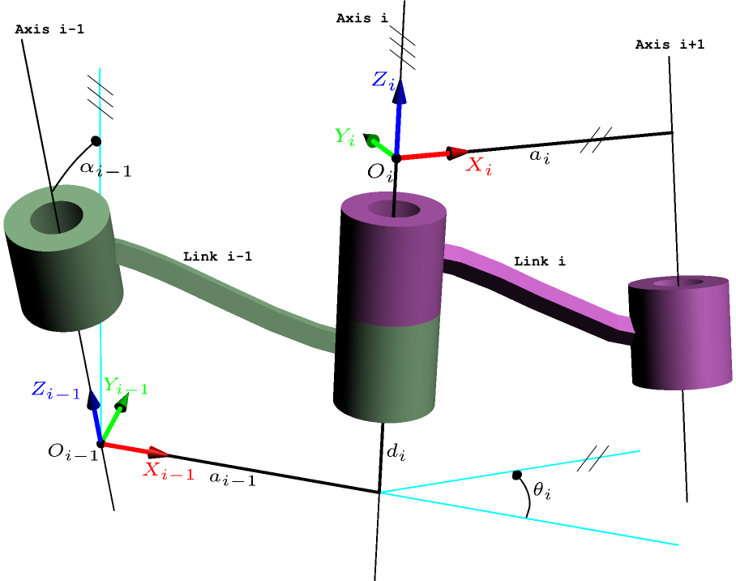

# yaik

A python package for generating closed-form inverse kinematic solvers for robotics manipulators. The generated solvers support many robots in Mech-Mind Robotics and have been extensively tested in real-world depolyment. The name **yaik** stands for **Y**et **A**nother **I**nverse **K**inematics generator.

### Features

- Closed-form, analytical inverse kinematics for serial chain robots in python/C++
- Support robots with 7 DoF or more, such as [Kuka IIwa Arm](./gallery/kuka_iiwa), [Panda Robot](./gallery/franka_panda), or arms of the Atlas humanoid
- A new factorized polynomial solution based on *groebner reduce*
- General 6-dof solution using linear matrix equations tangent of half angles
- Analysis to avoid degenerated (or conditional degenerated) solutions

### Using the generated solver

The [gallery](./gallery) contains generated IK solver for tens for robots. Even if your robot is not included in the library, it might include an robot with same structure and can be used after parameter modification. The file format is

```
gallery/
    puma/
        puma_ik.yaml
        puma_ik_generated.cpp
        puma_ik_generated.py
    {robot_name}/
        {robot_name}_ik.yaml
        {robot_name}_ik_generated.cpp
        {robot_name}_ik_generated.py
```

To use the generated C++ solver, you need to include the [yaik_cpp_common.h](./yaik_cpp_common.h) file, which further depends on Eigen. Please refer to the [yaik_cpp](./) repo for a example.

To use the generated python solver, you need to import [python_run_import.py](./python_run_import.py), which futher depends on numpy.

### Generate a solver for your robot

To use this package, you need to instanll python3 and [sympy](https://github.com/sympy/sympy/wiki/Download-Installation) on your system. Optionally, you might install [sagemath](https://www.sagemath.org/index.html), which contains a faster *groebner reduce* implementation.

Then, you need to express your robot into **Modified** DH format, as illustrated below



A documentation regarding that can be found in [here](./docs/modified_dh.md). Several examples can be found in [this file](./fk/robot_models.py). Alternatively, the modified dh model can be converted from chain model in [this file](./fk/chain_models.py), or URDF using a tool in another library.

After that, you can run `ik_solve.py` to generate the solution of your robot in YAML format. This step can take a LOT of time, as we perform offline analysis to find the simplest solution and avoid degeneration. Moreover, this step might fail to find a feasible solution (although the pipeline succeed for all the robots we tested).

Finally, you can use `cpp_codegen.py/py_codegen.py` to generate solvers in C++ and python, similiar to ones in the gallery.

### Acknowledgement

This work is done during author's empolyment at Mech-Mind Robotics. We have learned a lot from existing works, in particular [IkFast](https://github.com/rdiankov/openrave) and [IKBT](https://github.com/uw-biorobotics/IKBT).

### Contact

If you have a new chellanging robot that cannot be solved, please send me an email.
